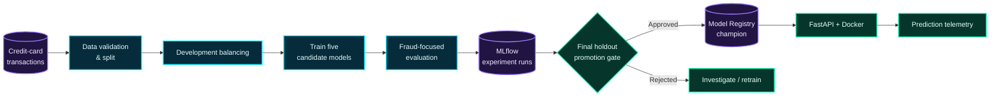
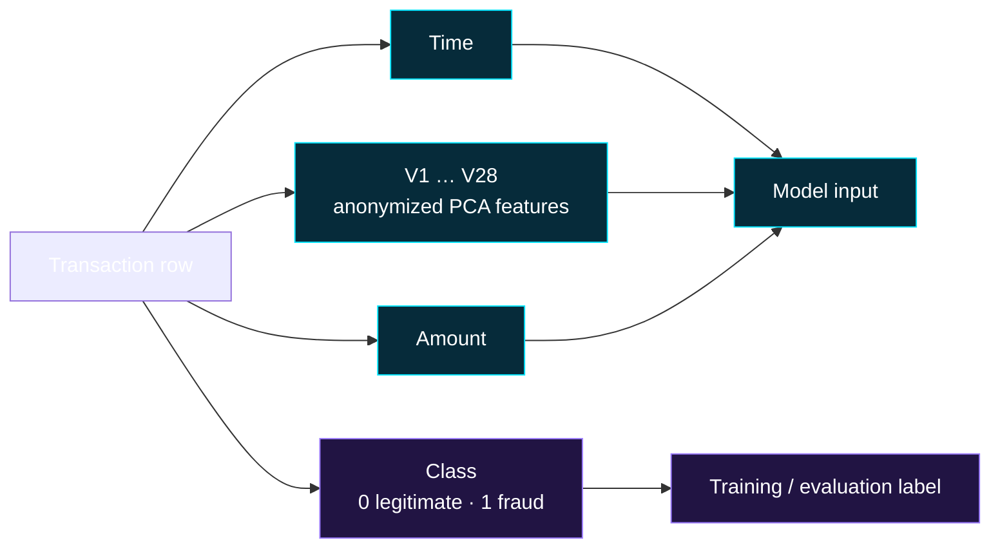
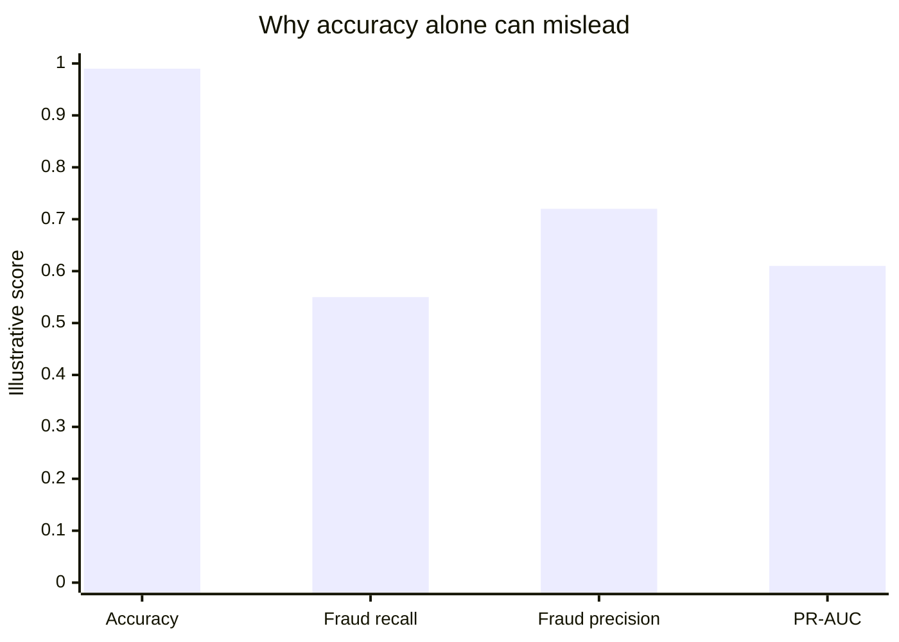
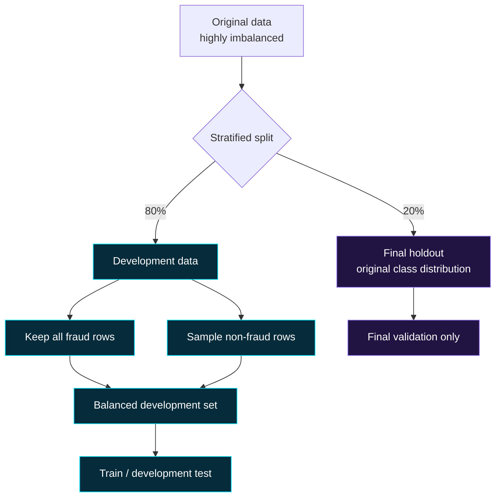
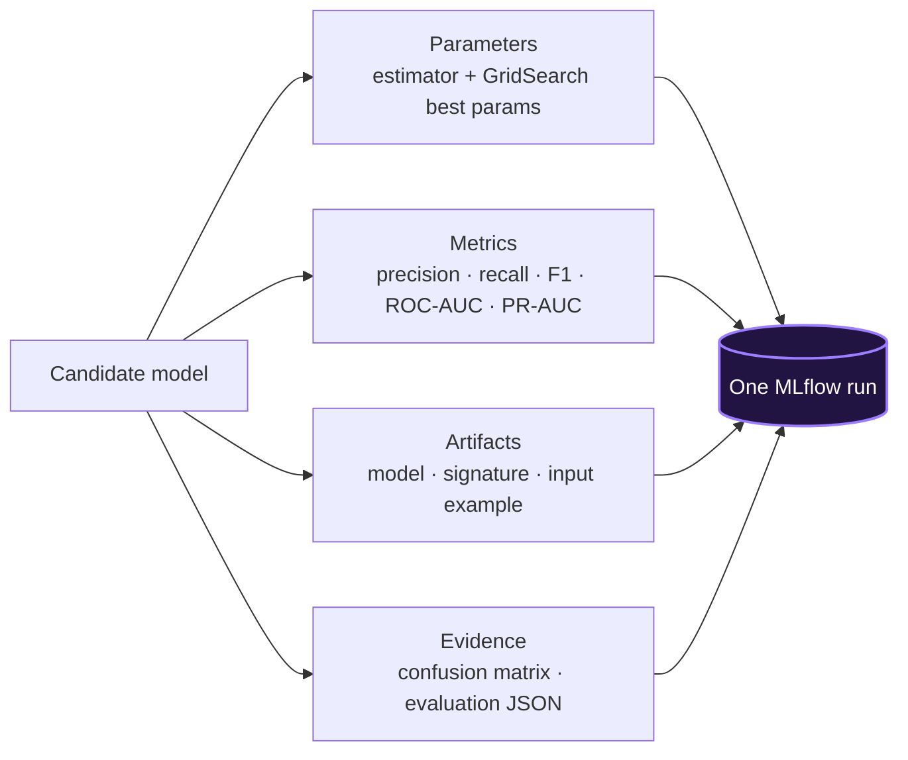
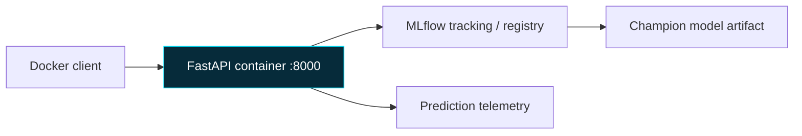

<div align="center">

# ◈ FRAUD DETECTION // MODEL OPERATIONS LAB

### From imbalanced transactions to an auditable, deployable ML service


`DETECT` → `MEASURE` → `TRACK` → `GATE` → `SERVE` → `OBSERVE`

</div>

---

## Mission control

Fraud is a rare-event classification problem: a model can be highly accurate while still missing the transactions that matter. This project uses the ULB credit-card dataset to compare five classifiers, optimize fraud-focused metrics, record every experiment in MLflow, and package approved models for API deployment.

The purpose is not merely to train a model. It is to demonstrate how an ML system can be made reproducible, reviewable, and safer to operate.

> **A small philosophical note.** Fraud detection is an exercise in attention: most transactions are ordinary, but the system is judged by how carefully it notices the few that are not. The goal is not to automate suspicion. It is to build a decision-support system that makes its uncertainty, evidence, and limits visible to the people accountable for acting on it.



## The signal: what is in the data?

The project uses the public **ULB Credit Card Fraud Detection** dataset: European card transactions from September 2013. It contains **284,807 transactions**, of which **492 are frauds**—roughly **0.17%** of the data. That extreme imbalance is the central engineering and modelling challenge.

| Field group | Fields | Meaning | How this project uses it |
|---|---|---|---|
| Transaction time | `Time` | Seconds elapsed since the first transaction in the dataset | Numeric model feature |
| Anonymized behaviour | `V1` … `V28` | PCA-transformed, anonymized transaction features | Numeric model features; their business meaning is intentionally unavailable |
| Transaction value | `Amount` | Transaction amount | Numeric model feature |
| Ground-truth label | `Class` | `0` = legitimate; `1` = fraud | Prediction target; never supplied to inference |



Because the `V1`–`V28` features are anonymized and PCA transformed, this dataset is excellent for demonstrating the **ModelOps lifecycle** but limited for business interpretation, fairness analysis, and real-world feature lineage. A production fraud system would pair this workflow with governed source data, feature definitions, delayed fraud labels, privacy controls, and human review processes.

## The agenda

This repository follows a deliberate progression from a notebook-scale model to an operational ML lifecycle:

1. **Understand the imbalance** — make fraud-focused evaluation the default.
2. **Create reproducible experiments** — retain data-split decisions, parameter searches, metrics, and artifacts.
3. **Establish a release decision** — distinguish a promising candidate from a model approved to serve.
4. **Serve with a contract** — validate incoming feature schema and load a named model version.
5. **Observe and improve** — collect safe operational signals, retrain candidates, and preserve a rollback path.

The larger lesson is simple: a model is not a product at the moment it produces a score. It becomes a dependable system only when the path from data to decision can be inspected, challenged, and improved.

## Why fraud metrics—not just accuracy?

<table>
<tr><th>Metric</th><th>Question it answers</th><th>Why it matters here</th></tr>
<tr><td><b>Precision</b></td><td>Of transactions flagged as fraud, how many were truly fraudulent?</td><td>Controls unnecessary reviews and customer friction.</td></tr>
<tr><td><b>Recall</b></td><td>Of actual fraud, how much did we catch?</td><td>Missing fraud can be expensive; this is a core safety metric.</td></tr>
<tr><td><b>Fraud F1</b></td><td>How balanced are fraud precision and recall?</td><td>Primary candidate-comparison metric.</td></tr>
<tr><td><b>PR-AUC</b></td><td>How well are rare positives ranked?</td><td>More informative than accuracy under strong class imbalance.</td></tr>
<tr><td><b>ROC-AUC</b></td><td>How well are classes separated across thresholds?</td><td>Useful ranking context, but not enough by itself.</td></tr>
</table>



> The chart is illustrative, not a claimed project result. Actual values live in MLflow for each run.

---

## Flight plan: from data to service

### 1. Prepare the data

`main.py` loads `data/creditcard.csv`, validates the binary `Class` label, then creates a stratified 20% final holdout **before** balancing the development data. Only the development partition is down-sampled to make model search practical.



### 2. Train candidate models

The pipeline evaluates the existing five model families:

| Candidate | Search strategy | Notes |
|---|---|---|
| Random Forest | GridSearchCV | Tree ensemble baseline |
| Gradient Boosting | GridSearchCV | Non-linear boosted ensemble |
| Logistic Regression | Fixed configuration | Scaled, interpretable baseline |
| SVM | GridSearchCV | Scaled feature pipeline |
| KNN | GridSearchCV | Scaled distance-based baseline |

Grid searches use fraud F1 for scoring. Their `best_params_`, best cross-validation score, and candidate count are kept as training metadata—not just printed to the console.

### 3. Tune the decision threshold

Models produce a fraud score. A threshold sweep on development data chooses the threshold that maximizes fraud F1. The selected threshold and both development/final metrics are recorded in the experiment metadata.

### 4. Validate and track

Each fully evaluated candidate becomes one MLflow run in the **Fraud Detection** experiment.



---

## Quick start

### Prerequisites

- Python 3.11+
- The dataset at `data/creditcard.csv`
- Docker Desktop (only for container execution)

```powershell
git clone https://github.com/rachit-bhatt/Fraud-Detection.git
cd Fraud-Detection

python -m venv .venv
.\.venv\Scripts\Activate.ps1
pip install -r requirements.txt

# Reduced grids; trains all five model families
python main.py --quick
```

Remove `--quick` for the complete bounded hyperparameter search.

### Inspect experiments

```powershell
mlflow ui --backend-store-uri sqlite:///runtime/mlflow.db --host 127.0.0.1 --port 5000
```

Open [http://127.0.0.1:5000](http://127.0.0.1:5000), select **Fraud Detection**, sort candidates by `final_fraud_f1` and `final_fraud_recall`, then inspect the Parameters and Artifacts tabs.

### Promotion gate

Promotion is intentional—not automatic. A candidate must meet final-holdout fraud F1 ≥ `0.85` and recall ≥ `0.80` before it can receive the MLflow `champion` alias.

```powershell
python main.py --quick --promote
```

If the gate fails, the command stops and the current champion remains unchanged.

---

## Serving the approved model

The FastAPI service loads the registry champion and its separately logged inference contract by default:

```text
models:/fraud-detection-model@champion
```

```powershell
uvicorn api:app --reload
```

| Endpoint | Purpose |
|---|---|
| `GET /health` | Confirms the configured MLflow model can load |
| `POST /predict` | Validates the approved feature contract and returns a fraud prediction/score |
| `GET /metrics` | Returns lightweight prediction-volume telemetry |

Example request shape:

```json
{
  "features": {
    "Time": 0.0,
    "V1": -1.3598,
    "V2": -0.0728
  }
}
```

> Send every feature expected by the trained model. The service rejects missing or unexpected fields rather than silently changing feature order. The decision threshold is loaded from the approved champion contract; API callers cannot override it.

## Containerization

```powershell
docker build -t fraud-detection-api .
docker run --rm -p 8000:8000 `
  -e MLFLOW_TRACKING_URI="sqlite:///runtime/mlflow.db" `
  -e MLFLOW_MODEL_URI="models:/fraud-detection-model@champion" `
  fraud-detection-api
```



For local development, runtime state is isolated in the ignored `runtime/` directory. For a real deployment, set `MLFLOW_TRACKING_URI` to a shared MLflow Tracking Server; its database and artifact store must be remotely accessible to both training and the API. Inject configuration through environment variables or a secrets manager—never source code.

---

## Delivery controls

| Control | Implementation |
|---|---|
| Reproducibility | Fixed random seed, tracked configurations, saved parameters and artifacts |
| Experiment traceability | One MLflow run per candidate model |
| Release governance | Final-holdout F1/recall promotion gate and `champion` alias |
| Inference contract | Feature-name validation before scoring |
| Privacy awareness | Telemetry avoids raw transaction feature values |
| CI | GitHub Actions runs tests and builds the Docker image |
| Candidate retraining | Scheduled workflow creates candidates; it does not auto-deploy |
| Cloud handoff | Azure Container Apps configuration template in `azure/containerapp.yaml` |

## Repository map

```text
Fraud-Detection/
├── main.py                       # training, threshold tuning, validation
├── mlops.py                      # MLflow tracking and promotion gate
├── api.py                        # FastAPI inference service
├── monitoring.py                 # privacy-minimized prediction telemetry
├── retrain.py                    # scheduled candidate-training entry point
├── tests/                        # pipeline tests
├── .github/workflows/            # CI + scheduled retraining
├── azure/                        # cloud deployment template
├── docs/MODEL_CARD.md            # intended use, limitations, governance
└── Dockerfile                    # API container image
```

## ModelOps interview talking points

1. **Evaluation:** “I optimized and compared fraud-class F1, recall, and PR-AUC rather than treating accuracy as the objective.”
2. **Reproducibility:** “Every candidate has an MLflow run containing its parameters, GridSearch best parameters, metrics, artifacts, and serialized model.”
3. **Lifecycle control:** “A candidate is not a deployment. Promotion is gated on final-holdout criteria and explicitly assigns a registry alias.”
4. **Serving:** “The API validates the feature contract before scoring and loads an approved registry model rather than a local ad-hoc pickle.”
5. **Operations:** “The system separates candidate retraining from promotion and starts collecting privacy-aware inference telemetry for monitoring.”

<div align="center">

### `STATUS: BUILDING A MORE TRUSTWORTHY MODEL LIFECYCLE` ◈

</div>
